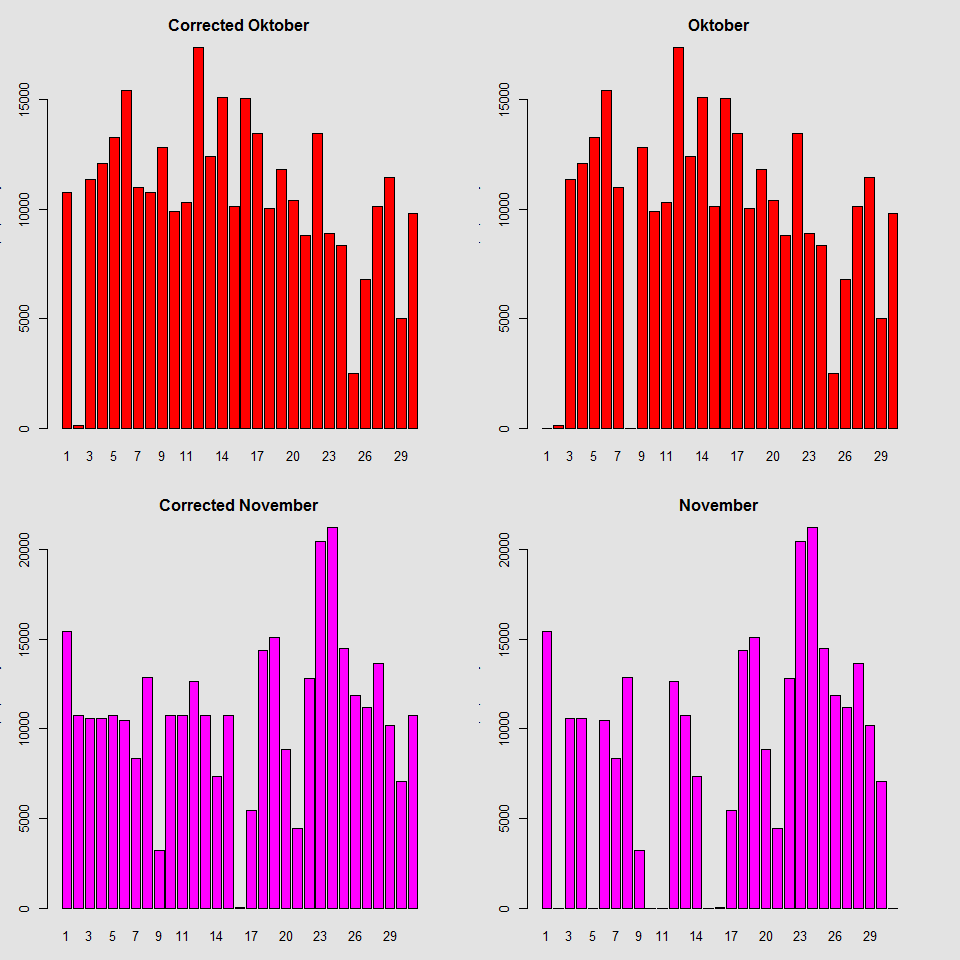

# Reproducible Research: Peer Assessment 1

This is a report of the Coursera course Reproducible Research first assignment. 
This assignment makes use of data from a personal activity monitoring device. This device collects data at 5 minute intervals through out the day. The data consists of two months of data from an anonymous individual collected during the months of October and November, 2012 and include the number of steps taken in 5 minute intervals each day.


## Loading and preprocessing the data


First to read the data into R.

```r
activity <- read.csv("activity.csv", 
                     na.strings = "NA", 
                     colClasses = c("integer", "Date", "integer"))
```


## What is mean total number of steps taken per day?


Then we want to know what the mean total number of steps taken per day is, while ignoring the missing values.


```r
steps_by_day <- aggregate(activity$steps, by = list(activity$date), FUN = sum, na.rm = TRUE)
names(steps_by_day) <- c("date", "steps")

sbd_oktober <- subset(steps_by_day, steps_by_day$date <= "2012-10-30") 
sbd_november <- subset(steps_by_day, steps_by_day$date > "2012-10-30")

par(mfrow = c(2,1), bg = "#e3e3e3")
barplot(sbd_oktober$steps, names.arg = c(1:length(sbd_oktober$date)), xlab = "Day of the month",
        ylab = "Total steps per day", main = "Oktober", col = "red")
barplot(sbd_november$steps, names.arg = c(1:length(sbd_november$date)), xlab = "Day of the month", ylab = "Total steps per day", main = "November", col = "magenta")
```


The mean and the median of the total numbers steps taken per day were caclulated with the following code.


```r
mean(steps_by_day$steps)
```

```
## [1] 9354.23
```

```r
median(steps_by_day$steps)
```

```
## [1] 10395
```

## What is the average daily activity pattern?

Te gain some insight in the average daily activity a time series plot was created.


```r
par(bg = "#e3e3e3")
steps_by_int <- aggregate(activity$steps, by = list(activity$interval), FUN = mean, na.rm = TRUE)
names(steps_by_int) <- c("interval", "average_steps")
plot(steps_by_int$interval, steps_by_int$average_steps, type = "l", xlab = "5 Minute Interval",
     ylab = "Average Steps", main = "Average Daily Activity Pattern")
```


It is also interesting to know on which specific interval the subject made the most steps on average.


```r
max_steps <- max(steps_by_int$average_steps)
most_steps_at_interval <- steps_by_int[steps_by_int$average_steps == max_steps ,]
print(most_steps_at_interval)
```

```
##     interval average_steps
## 104      835      206.1698
```
As we can see from the plot the highest spike is somewhere around the 800 mark, which checks out compaired to the calculation above which produces the interval 835 as the interval with the highest average steps taken per day.

##Imputing missing values

The presence of missing days may introduce bias into some calculations or summaries of the data.
Therefore some steps are taken to fill in the missing values, and to compare them with the original computations and see if there are any differences.

First we'd like to know how many missing entries there are.

```r
sum(is.na(activity$steps))
```

```
## [1] 2304
```

Then a new dataframe corr_activity was created with the missing entries filled with the mean for that interval.

```r
corr_activity <- activity
corr_activity[is.na(corr_activity$steps), "steps"] <- steps_by_int$average_steps
str(corr_activity); summary(corr_activity)
```

```
## 'data.frame':	17568 obs. of  3 variables:
##  $ steps   : num  1.717 0.3396 0.1321 0.1509 0.0755 ...
##  $ date    : Date, format: "2012-10-01" "2012-10-01" ...
##  $ interval: int  0 5 10 15 20 25 30 35 40 45 ...
```

```
##      steps             date               interval     
##  Min.   :  0.00   Min.   :2012-10-01   Min.   :   0.0  
##  1st Qu.:  0.00   1st Qu.:2012-10-16   1st Qu.: 588.8  
##  Median :  0.00   Median :2012-10-31   Median :1177.5  
##  Mean   : 37.38   Mean   :2012-10-31   Mean   :1177.5  
##  3rd Qu.: 27.00   3rd Qu.:2012-11-15   3rd Qu.:1766.2  
##  Max.   :806.00   Max.   :2012-11-30   Max.   :2355.0
```

The new histograms are now as follows. 

```r
corr_steps_by_day <- aggregate(corr_activity$steps, by = list(activity$date), FUN = sum)
names(corr_steps_by_day) <- c("date", "steps")

csbd_oktober <- subset(corr_steps_by_day, corr_steps_by_day$date <= "2012-10-30") 
csbd_november <- subset(corr_steps_by_day, corr_steps_by_day$date > "2012-10-30")

par(mfcol = c(2,2), mar = rep(3, 4), bg = "#e3e3e3")
barplot(csbd_oktober$steps, names.arg = c(1:30), xlab = "Day of the month",
        ylab = "Total steps per day", main = "Corrected Oktober", col = "red")
barplot(csbd_november$steps, names.arg = c(1:31), xlab = "Day of the month",
        ylab = "Total steps per day", main = "Corrected November", col = "magenta")
barplot(sbd_oktober$steps, names.arg = c(1:length(sbd_oktober$date)), xlab = "Day of the month",
        ylab = "Total steps per day", main = "Oktober", col = "red")
barplot(sbd_november$steps, names.arg = c(1:length(sbd_november$date)), xlab = "Day of the month", ylab = "Total steps per day", main = "November", col = "magenta")
```



The mean and the median of the corrected dataframe were the following:

```r
mean(corr_steps_by_day$steps)
```

```
## [1] 10766.19
```

```r
median(corr_steps_by_day$steps)
```

```
## [1] 10766.19
```

From the new histograms there can be observed that certain days now do show an amount of steps taken per day. We can also seen an increase in the mean and median, but that is to be expected since new values were added to the corrected dataframe.
Interestingly not all days with zero steps walked showed an increase after correction. 
A possible explanation could be that the device was turned on and registering activities but not worn, so no steps were measured.

##Are there differences in activity patterns between weekdays and weekends?

Finally the data was examined to discover whether there were differences between weekdays and weekends.
First, new dataframes were created for weekdays and weekends respectively.

```r
corr_activity$day <- as.POSIXlt(corr_activity$date)$wday
corr_activity$daytype <- as.factor(ifelse(corr_activity$day == 0 | corr_activity$day == 6,
                                          "weekend", "weekday"))
corr_activity <- subset(corr_activity, select = -c(day))

weekday_act <- corr_activity[corr_activity$daytype == "weekday",]
weekend_act <- corr_activity[corr_activity$daytype == "weekend",]
        
weekday_act_by_int <- aggregate(weekday_act$steps, by = list(weekday_act$interval), FUN = mean)
names(weekday_act_by_int) <- c("interval", "average_steps")
weekend_act_by_int <- aggregate(weekend_act$steps, by = list(weekend_act$interval), FUN = mean)
names(weekend_act_by_int) <- c("interval", "average_steps") 
```

Then these dataframes were plotted in a time series plot

```r
par(mfrow = c(2,1), mar = c(2, 6, 2, 6), bg = "#e3e3e3")

plot(weekday_act_by_int$interval, weekday_act_by_int$average_steps, type = "l", main = "weekday",
     xlab = "Interval", ylab = "Avg. Steps")
plot(weekend_act_by_int$interval, weekend_act_by_int$average_steps, type = "l", main = "weekend",
     xlab = "Interval", ylab = "Avg. Steps")
```


